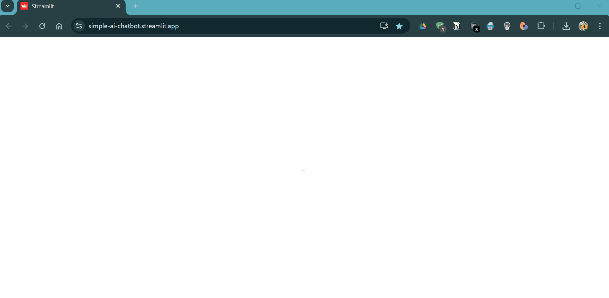

# 🤖 Simple AI ChatBot

A user-friendly AI chatbot built using **Streamlit** and **HuggingFace's DialoGPT** model. It interacts naturally and answers your questions clearly.

---

## 🎯 **Demo**



*(GIF demonstrates chatbot interaction)*

Try out the live chatbot here: [**Gon's Simple AI ChatBot**](https://simple-ai-chatbot.streamlit.app/)

---

## 🚀 **Technologies Used**

- Python
- Streamlit
- HuggingFace Transformers (DialoGPT)
- PyTorch

---

## 🛠 **Installation**

Clone this repository:

```bash
git clone https://github.com/biplobgon/simple-ai-chatbot.git
cd simple-ai-chatbot
